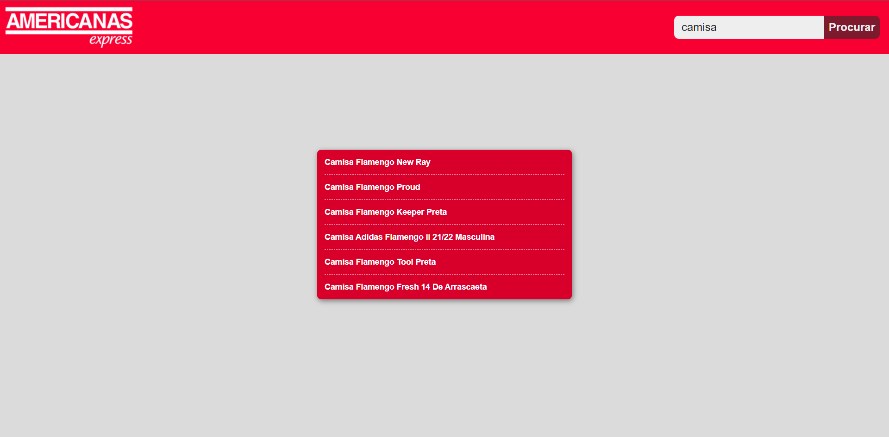

# Calindra: Desafio Front End 1 👨🏻‍💻

  <a href="#sobre">Sobre</a>&nbsp;&nbsp;
  <a href="#andamento">Andamento</a>&nbsp;&nbsp;
  <a href="#linguagens">Softwares & Ferramentas utilizadas</a>&nbsp;&nbsp;
  <a href="#habilidades">Habilidades adquiridas</a>&nbsp;&nbsp;
    <a href="#contribuir">Como contribuir</a>&nbsp;&nbsp;
  <a href="#autor">Autor</a> 

<h2 id="sobre">Sobre 🔎</h2>
  
Construir uma aplicação na linguagem que preferir e achar mais prático. Neste desafio não é preciso desenvolver um layout robusto, pode ser algo simples. A aplicação deverá ter um input de
  texto e um botão busca que ao ser clicado realizará uma busca de produto através do consumo <a href="https://mystique-v2-americanas.juno.b2w.io/autocomplete?content=camiseta&source=nanook">dessa API</a>.

 

<h2 id="andamento">Andamento do projeto 📈</h2>

  

<h2 id="linguagens">Softwares & Ferramentas utilizadas nesse projeto 📚</h2>

  - [x] HTML
  - [x] CSS
  - [x] Javascript
  - [x] Git
  - [x] API

<h2 id="habilidades">Habilidades Adquiridas 📝</h2>

  - Consumo de API's
  - Trabalho com prazos

<h2 id="contribuir">Como contribuir 📫</h2>

Para contribuir com meu projeto, siga estas etapas:
  >- Bifurque este repositório.
  >- Crie um branch: `git checkout -b <nome_branch>`.
  >- Faça suas alterações e confirme-as: `git commit -m '<mensagem_commit>'`
  >- Envie para o branch original: `git push origin <nome_do_projeto> / <local>`
  >- Crie a solicitação de pull.
*Consulte a documentação do GitHub em* [como criar uma solicitação pull](https://help.github.com/en/github/collaborating-with-issues-and-pull-requests/creating-a-pull-request).

  
  **Criado e desenvolvido por [Ytallo Bruno](https://www.linkedin.com/in/ytallobruno/).**
  
 
 
  
   &nbsp;&nbsp;&nbsp;&nbsp;&nbsp;
  
   &nbsp;&nbsp;&nbsp;&nbsp;&nbsp;
  
  

 

  &#11165;&nbsp;<a href="#inicio"><strong>Voltar ao topo</strong></a>&nbsp;&#11165;

